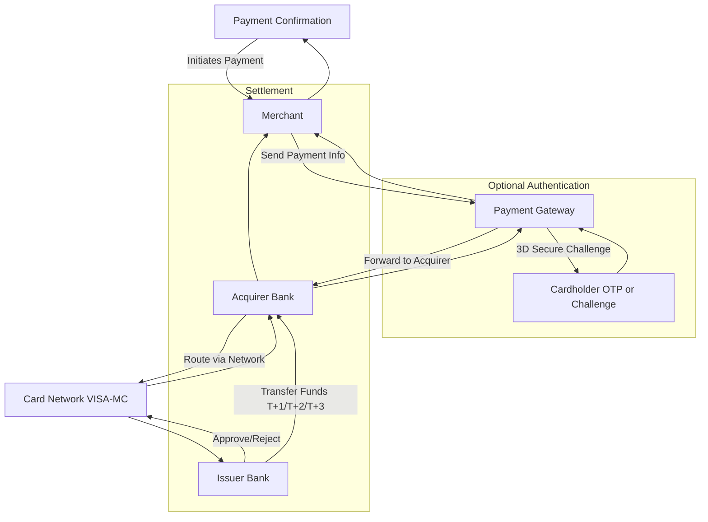

<h1 align="center">💳 Payment Gateway Education</h1>

<p align="center">
  
  
  
  
  
  
  
  
  
</p>

</p>

---

<p align="center">
  
</p>

---

<h2 align="center">⚠️ Disclaimer</h2>
<p align="center">
Project ini bersifat edukatif dan **tidak boleh digunakan untuk transaksi nyata**.  
Semua data kartu dan transaksi hanya untuk pembelajaran.
</p>

---

<h2 align="center">📖 Deskripsi</h2>

<p align="center">
Mini project edukatif yang mensimulasikan alur transaksi <b>Payment Gateway</b>:  
dari pemegang kartu → merchant → payment gateway → acquirer → issuer → settlement.  
Tujuan: memahami <b>authorization, authentication, clearing, settlement</b>,  
jenis transaksi, dan keamanan kartu digital.  
Cocok untuk belajar <b>Cyber Security, FinTech, dan blockchain payment insight</b>.
</p>


---

<h2 align="center">⚡ Struktur Dasar Kartu</h2>
<div align="center">
<table>
  <tr>
    <th>Elemen</th>
    <th>Keterangan</th>
  </tr>
  <tr>
    <td>Card Number (PAN)</td>
    <td>16 digit unik kartu</td>
  </tr>
  <tr>
    <td>Cardholder Name</td>
    <td>Nama pemilik kartu</td>
  </tr>
  <tr>
    <td>Expiry Date</td>
    <td>Bulan/Tahun kadaluarsa</td>
  </tr>
  <tr>
    <td>CVV/CVC</td>
    <td>3 digit keamanan di belakang kartu</td>
  </tr>
  <tr>
    <td>Issuer Bank</td>
    <td>Bank penerbit kartu</td>
  </tr>
  <tr>
    <td>Network</td>
    <td>VISA / Mastercard</td>
  </tr>
</table>
</div>

---

<h2 align="center">🏦 Peran dalam Network</h2>
<div align="center">
<table>
  <tr>
    <th>Role</th>
    <th>Fungsi</th>
  </tr>
  <tr>
    <td>Cardholder</td>
    <td>Pemilik kartu</td>
  </tr>
  <tr>
    <td>Merchant</td>
    <td>Penjual / penyedia jasa</td>
  </tr>
  <tr>
    <td>Acquirer Bank</td>
    <td>Bank merchant, menerima transaksi</td>
  </tr>
  <tr>
    <td>Issuer Bank</td>
    <td>Bank pemegang kartu</td>
  </tr>
  <tr>
    <td>Card Network</td>
    <td>VISA / Mastercard, routing & settlement</td>
  </tr>
  <tr>
    <td>Payment Gateway</td>
    <td>Menyambungkan merchant dengan acquirer & network</td>
  </tr>
</table>
</div>

---

<h2 align="center">🚀 Alur Transaksi (Basic Flow)</h2>

<p align="center">

| Langkah | Penjelasan |
|:-------:|------------|
| Authorization | Pemegang kartu → Merchant → Payment Gateway → Acquirer Bank → Card Network → Issuer Bank → Approve/Reject |
| Authentication (Opsional) | 3D Secure (Verified by Visa / Mastercard SecureCode) → OTP atau challenge |
| Clearing | Transaksi disetujui → dikumpulkan dalam batch untuk diproses |
| Settlement | Uang dikirim dari Issuer Bank → Acquirer Bank → Merchant (T+1 sampai T+3 hari kerja) |

</p>

---

<h2 align="center">📊 Alur Transaksi </h2>
<div align="center">



<h2 align="center">📌 Penjelasan Alur Transaksi</h2>

<p align="center">

| Alur | Penjelasan |
|:----:|------------|
| Cardholder → Merchant | Pemegang kartu memulai transaksi, memasukkan data kartu untuk pembelian. |
| Merchant → Payment Gateway | Merchant mengirimkan informasi pembayaran ke Payment Gateway untuk diproses. |
| Payment Gateway → Acquirer Bank | Gateway meneruskan data ke bank merchant (Acquirer Bank). |
| Acquirer Bank → Card Network | Transaksi dirutekan melalui jaringan kartu (VISA/Mastercard) ke Issuer Bank. |
| Issuer Bank → Card Network | Bank penerbit mengecek saldo dan validitas kartu, lalu approve atau reject. |
| Card Network → Acquirer → Gateway → Merchant → Cardholder | Hasil otorisasi dikirim balik sampai ke pemegang kartu sebagai konfirmasi. |
| Optional Authentication (3D Secure / OTP) | Jika diaktifkan, pemegang kartu harus melewati challenge/OTP untuk keamanan tambahan. |
| Settlement (T+1/T+2/T+3) | Dana ditransfer dari Issuer Bank ke Acquirer Bank, lalu ke merchant sesuai jadwal. |

</p>

---

<h2 align="center">📌 Jenis & Komponen Payment Gateway</h2>

<p align="center">

| No | Topik | Penjelasan |
|:--:|-------|------------|
| 1 | Jenis Payment Gateway | - Hosted Payment Page: User diarahkan ke halaman payment gateway pihak ketiga (contoh: PayPal, Midtrans)<br>- API Payment Gateway: Integrasi langsung ke website/app merchant (contoh: Stripe API, Xendit API)<br>- Local vs Global Gateway: Local (BNI, Mandiri), Global (VISA, Mastercard, PayPal) |
| 2 | Komponen Utama | - Merchant Account: Akun untuk menerima pembayaran<br>- Payment Processor: Proses transaksi antar bank & network<br>- Acquirer Bank: Bank merchant yang menerima pembayaran<br>- Issuer Bank: Bank pemegang kartu<br>- Card Network: VISA/Mastercard, sebagai penghubung antara Acquirer dan Issuer |
| 3 | Jenis Transaksi yang Didukung | - Authorization: Mengecek ketersediaan dana<br>- Capture/Settlement: Transfer dana ke merchant<br>- Refund/Reversal: Pengembalian dana ke customer<br>- Recurring/Subscription: Pembayaran otomatis periodik |
| 4 | Keamanan & Compliance | - PCI DSS: Standar keamanan data kartu<br>- 3D Secure: Verified by Visa/Mastercard SecureCode<br>- Tokenization: Mengganti nomor kartu asli dengan token<br>- Fraud Detection: Memantau transaksi mencurigakan |
| 5 | Biaya & Fee | - Transaction Fee: Biaya setiap transaksi (persentase + flat)<br>- Setup Fee: Biaya awal integrasi gateway<br>- Cross-Border Fee: Untuk kartu luar negeri |
| 6 | Reporting & Dashboard | - Monitoring transaksi real-time<br>- Rekonsiliasi settlement & refund<br>- Analitik transaksi: top products, peak hours, failed payments |

</p>

---

<p align="center">
Payment Gateway tidak hanya memproses transaksi, tapi juga memastikan <b>keamanan, kepatuhan, dan efisiensi</b> alur pembayaran. Beberapa poin penting yang perlu dipahami:
</p>

<h2 align="center">🔹 Poin Penting Payment Gateway</h2>

<p align="center">

| Poin | Penjelasan |
|:----:|------------|
| Integrasi Gateway | Melalui API atau Hosted Page. Merchant harus menyiapkan callback/webhook untuk konfirmasi transaksi. |
| Error Handling | Gateway memberikan response code seperti Approved, Declined, Insufficient Funds, Card Expired. Merchant wajib menangani setiap skenario. |
| Multi-Currency & Conversion | Mendukung berbagai mata uang dengan konversi real-time. |
| Settlement Timing | Dana dikirim ke merchant sesuai T+1/T+2/T+3, mempengaruhi cashflow bisnis. |
| Fraud Prevention | CVV, AVS, 3D Secure, tokenization, dan monitoring IP untuk mencegah penipuan. |
| Reporting & Analytics | Merchant memperoleh dashboard laporan transaksi, refund, failed payments, dan insight bisnis. |
| Compliance & Regulation | Mematuhi PCI DSS dan regulasi lokal/internasional terkait data kartu kredit. |
| Future Trends | Gateway berbasis blockchain, crypto, dan open banking untuk settlement instan. |

</p>


<p align="center">
Memahami poin-poin ini membantu developer dan merchant membuat sistem pembayaran yang <b>aman, efisien, dan transparan</b>.
</p>

---

<p align="center">
  Contoh implementasi Payment Gateway sederhana menggunakan C++:  
  Authorization, Authentication, Settlement, Refund, dan Full Transaction.
</p>

---

<h2 align="center">📂 Daftar File</h2>

<p align="center">

| File | Deskripsi | Cara Run |
|:----:|-----------|:--------:|
| `authorization.cpp` | Implementasi Authorization kartu | `g++ authorization.cpp -o authorization && ./authorization` |
| `authentication.cpp` | Implementasi 3D Secure / OTP | `g++ authentication.cpp -o authentication && ./authentication` |
| `settlement.cpp` | Implementasi Settlement ke merchant | `g++ settlement.cpp -o settlement && ./settlement` |
| `refund.cpp` | Implementasi Refund ke pemegang kartu | `g++ refund.cpp -o refund && ./refund` |
| `transaction.cpp` | Full Transaction: Authorization → Authentication → Settlement | `g++ transaction.cpp -o transaction && ./transaction` |

</p>


---

<h2 align="center">💻 Cara Jalankan Project</h2>

<p align="center">

```bash
# Clone repository
git clone https://github.com/kongali1720/payment-gateway-cpp.git
cd payment-gateway-cpp

# Pastikan sudah ada C++ compiler (g++)
# Compile & jalankan file yang diinginkan
g++ nama_file.cpp -o nama_output
./nama_output
```

<h2 align="center">📖 Penjelasan Singkat Payment Gateway</h2>

<p align="center">

| Langkah | Penjelasan Singkat |
|:-------:|------------------|
| Authorization | Memeriksa saldo & validitas kartu |
| Authentication | OTP / 3D Secure challenge |
| Settlement | Transfer dana ke merchant |
| Refund | Pengembalian dana ke pemegang kartu |
| Full Transaction | Menggabungkan semua langkah di atas |

</p>

---

<h2 align="center">📜 License</h2>

<p align="center">
This project is licensed under the <a href="LICENSE">MIT License</a>.<br>
You are free to use, modify, and distribute this project under the terms of MIT.
</p>

---

<h3 align="center" style="color:#39ff14; font-size:1.5rem;">
💡 ☕ Traktir Kopi & Nasi Padang / Nasi Gorengnya ya cuy! 😄
</h3>

<div align="center">

<p style="color:#ffffff; font-size:1.1rem;">
Dukung terus biar semangat bikin karya edukatif lainnya...  
Keep supporting so I stay motivated to create more educational works!
</p>

<a href="https://www.paypal.com/paypalme/bungtempong99" target="_blank" style="text-decoration:none;">
  
</a>

<p style="color:#39ff14; font-size:1rem; margin-top:8px;">
Support with ☕ so I can buy 🍜 and keep being 🧠!
</p>

</div>

---

<h2 align="center" style="color:#39ff14;">📫 Let’s Connect Like Hackers</h2>

<div align="center">

<table style="margin: 0 auto; border-collapse: collapse;">
  <thead>
    <tr>
      <th style="padding: 12px 25px; font-size: 18px; color:#ffffff;">Platform</th>
      <th style="padding: 12px 25px; font-size: 18px; color:#ffffff;">Detail</th>
    </tr>
  </thead>
  <tbody>
    <tr>
      <td style="padding: 12px 25px; color:#39ff14;">GitHub</td>
      <td style="padding: 12px 25px;"><a href="https://github.com/kongali1720" target="_blank">kongali1720</a></td>
    </tr>
    <tr>
      <td style="padding: 12px 25px; color:#39ff14;">Email</td>
      <td style="padding: 12px 25px;"><a href="mailto:kongali1720@gmail.com">kongali1720@gmail.com</a></td>
    </tr>
    <tr>
      <td style="padding: 12px 25px; color:#39ff14;">Site</td>
      <td style="padding: 12px 25px;"><a href="https://younext.cloud" target="_blank">Coming soon — stay curious...</a></td>
    </tr>
  </tbody>
</table>

</div>

---

<h3 align="center" style="color:#ff69b4;">❤️ 💻 INITIATING HUMANITY MODE... for Down Syndrome ❤️</h3>

<div align="center">

<table style="margin: 0 auto; border-collapse: collapse; box-shadow: 0 4px 10px rgba(0,0,0,0.2); border-radius: 8px; overflow: hidden;">
  <thead style="background-color:#ff69b4; color:white;">
    <tr>
      <th style="padding: 12px 25px; font-size: 18px;">Item</th>
      <th style="padding: 12px 25px; font-size: 18px;">Keterangan / Description</th>
    </tr>
  </thead>
  <tbody style="background-color:#1a1a1a; color:#39ff14;">
    <tr>
      <td style="padding: 12px 25px;">🎯 Target</td>
      <td style="padding: 12px 25px;">Anak-anak Pejuang Down Syndrome / Kids with Down Syndrome</td>
    </tr>
    <tr>
      <td style="padding: 12px 25px;">📡 Status</td>
      <td style="padding: 12px 25px;">Butuh Dukungan / Needs Support</td>
    </tr>
    <tr>
      <td style="padding: 12px 25px;">🧠 Response</td>
      <td style="padding: 12px 25px;">Buka Hati + Klik Link = Satu Senyum Baru / Open Heart + Click Link = One New Smile</td>
    </tr>
  </tbody>
</table>

<p align="center" style="margin-top:15px; color:white; font-size:1rem;">
Mereka bukan berbeda — mereka dilahirkan untuk mengajarkan dunia tentang cinta yang murni dan kesabaran yang luar biasa.<br>
They are not different — they were born to teach the world pure love and extraordinary patience.
</p>

<p align="center" style="margin-top: 15px;">
  <a href="https://mydonation4ds.github.io/" target="_blank" style="display: inline-block; text-decoration:none;">
    
  </a>
</p>

---

<section align="center" style="font-family: Arial, sans-serif;">

<h2 style="margin-bottom: 15px; color: #0070f3;">💳 Dukungan Pembayaran</h2>

<table align="center" style="margin: 0 auto; border-collapse: collapse; border-radius: 8px; overflow: hidden;">
  <thead style="background-color: #0070f3; color: white;">
    <tr>
      <th style="padding: 10px 20px; font-size: 16px;">Visa</th>
      <th style="padding: 10px 20px; font-size: 16px;">Mastercard</th>
      <th style="padding: 10px 20px; font-size: 16px;">PayPal</th>
    </tr>
  </thead>
  <tbody style="background-color: #f9f9f9;">
    <tr>
      <td style="padding: 10px;">
        
      </td>
      <td style="padding: 10px;">
        
      </td>
      <td style="padding: 10px;">
        
      </td>
    </tr>
  </tbody>
</table>

</section>

---

<p align="center" style="margin-top: 15px;">
  Kalau project ini bantu kamu, jangan lupa kasih bintang ⭐ dan share ke teman-teman!<br>
  Follow <a href="https://twitter.com/kongali1720" target="_blank">@kongali1720</a> untuk diskusi & update seru 🔥
</p>

<p align="center" style="margin-top: 10px;">
  <a href="https://twitter.com/kongali1720" target="_blank">
    
  </a>
</p>


